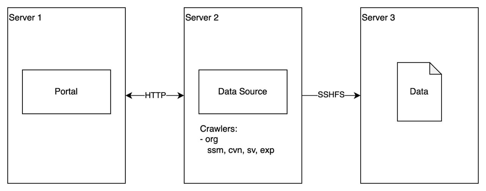

# Data Source Service

## General
Data source service provides the following functionality:
- Scans configured folders in the file system for the files with data of different types.
    - Uses sample sheets with required metadata and location of the files (if available).
    - Can use custom [crawler](./Docs/crawler.md) applications to locate the files (with required metadata) in configured folders.
    - Can use custom [reader](./Docs/reader.md) applications to convert the files to the format required by the UNITE portal.
- Hosts required files, and provides protected [web API](./Docs/api.md) to access them remotely.

## Access
Environment|Address|Port
-----------|-------|----
Host|http://localhost:5400|5400

## Configuration

### Application
To configure the application, change environment variables in either docker or [launchSettings.json](Unite.Data.Source.Web/Properties/launchSettings.json) file (if running locally):

- `ASPNETCORE_ENVIRONMENT` - ASP.NET environment (`Release`).
- `UNITE_API_KEY` - API key for decription of JWT token and user authorization.
- `UNITE_WORKER_HOST` - Public url of the current service (`http://source.data.unite.net`).
- `UNITE_WORKER_TOKEN` - UNITE worker JWT token to access the portal.
- `UNITE_PORTAL_HOST` - Public url of the portal service (`https://portal.unite.net`).  
    This parameter will be used, if custom feed services are not set.
- `UNITE_DONORS_FEED_HOST` - Public url of the donors feed service (`https://portal.unite.net/api/donors-feed`).  
    This parameter is and optional, if `UNITE_PORTAL_HOST` is set.
- `UNITE_IMAGES_FEED_HOST` - Public url of the images feed service (`https://portal.unite.net/api/images-feed`).  
    This parameter is and optional, if `UNITE_PORTAL_HOST` is set.
- `UNITE_SPECIMENS_FEED_HOST` - Public url of the specimens feed service (`https://portal.unite.net/api/specimens-feed`).  
    This parameter is and optional, if `UNITE_PORTAL_HOST` is set.
- `UNITE_OMICS_FEED_HOST` - Public url of the omics feed service (`https://portal.unite.net/api/omics-feed`).  
    This parameter is and optional, if `UNITE_PORTAL_HOST` is set.
- `UNITE_CONFIG_PATH` - Path to the configuration folder (`./config`).
- `UNITE_CACHE_PATH` - Path to the cache folder (`./cache`).
- `UNITE_DATA_PATH` - Path to the data folder (`/data`).  
    Allows to set custom root files path.

### Folders Configuration
To configure the service, to explore required data, create a configuration file `config.tsv` in the configuration folder (`UNITE_CONFIG_PATH`) with the following structure:
```tsv
path    types   crawler
relative/path/to/folder dna, dna-sm, dna-cnv, dna-sv, meth, rna, rna-exp, rnasc, rnasc-exp  default
```

Where:
- `path` - Relative (if `UNITE_DATA_PATH` is set) or absolute path to the folder where the service should look for the files.
- `types` - Comma separated list of the [data types](./Docs/types.md), files of which the service should look for in configured folder.
- `crawler` - Name of the crawler directory with custom crawler and readers.
    

#### Workflow
The workflow of the service is following:

- The service reads the `config.tsv` file line by line and for each data type from the `types` list of the line
    - Service is looking for corresponding samples sheet file with name `<type>.tsv` in the configured `path` folder.
        - If the file **exists**, the service will use it.
        - If the file **does not exist**, the service will try to use custom crawler in the configured `crawler` folder.  
          It will expect the application with the name **'crawler'** in the configured `crawler` folder.
    - For each file either from the samples sheet or found by the crawler:
        - If the file is a resource (`fasta`, `bam`, `idat`, etc.) the service will **host** it and send **only it's metadata** to Portal.
        - If the file is a data file (`snv.vcf`, `indel.vcf`, `cnv.tsv`, etc.), the service will send it to the Portal for further processing and integration.
            - If the format of the file is not supported by the Portal, the service will try to use a custom reader from the file metadata.
        
### Crawlers
Data crawlers(explorers) are **custom** applications used to find required files in desired folders.  
Please, read [crawlers](./Docs/crawler.md) documentation to understand how to create and configure them.

To configure the crawlers, create a configuration file `config.tsv` in the configuration folder ('UNITE_CONFIG_PATH') with the following structure:
```tsv
folder  crawler types
my/folder   my-crawler  dna, dna-sm, dna-cnv, dna-sv
```

- `folder` - Relative (if `UNITE_DATA_PATH` is set) or absolute path to the folder where the crawler should look for files.
- `crawler` - Name of the crawler to use. Application will expect the following:
    - There is a subfolder in the configuration folder (`UNITE_CONFIG_PATH`) with the **same** name as configured crawler.
    - There is an file in configured crawler folder with the name **'crawler'**.
- `types` - Comma separated list of [data types](./Docs/types.md) to look for in configured folder.

**For example:**
```txt
- /srv/config
    config.tsv
    - my-crawler
        crawler
```

> [!Note]
> If there is no crawlers configured, the application will do nothing.

> [!Warning]
> It's highly recommended to configure `UNITE_DATA_PATH` to desired root folder, so that the application can work with relative locations of the files and can run properly on different environments (e.g. local or docker) without changing the configuration. Otherwise, if you host the application on a different server, all links to hosted files will be **broken**.


## Installation

[.NET 8.0](https://dotnet.microsoft.com/en-us/download/dotnet/8.0) SDK is **required** to build and publish the application.

1) Open the terminal.

2) Add UNITE GitHub packages source for required **user** and **token** ([create](https://docs.github.com/en/authentication/keeping-your-account-and-data-secure/managing-your-personal-access-tokens) it if needed):
    ```bash
    dotnet nuget add source https://nuget.pkg.github.com/dkfz-unite/index.json -n github -u ${USER} -p ${TOKEN} --store-password-in-clear-text
    ```

3) Open project sources folder, e.g. `~/projects/unite-data-source`:
    ```bash
    cd ~/projects/unite-data-source
    ```

4) Build and publish the application to desired location where it's gonna be running on the server, e.g. `/srv/app`:
    ```bash
    dotnet publish Unite.Data.Source.Web -c Release -o /srv/app -p:PublishSingleFile=true -p:EnableCompressionInSingleFile=true -p:DebugType=None --self-contained   
    ```

5) Navigate to just published application folder:
    ```bash
    cd /srv/app
    ```

6) Run and host the application publicly on the server:
    ```bash
    ./Unite.Data.Source.Web --urls http://0.0.0.0:80
    ```

7) Configure the application:

    If configuration location wasn't changed in the previous steps, the application will expect configuration files to be in `./config` folder relative to where the app is running (e.g. `/srv/app/config`).

    - Prepare the configuration file `config.tsv` with information about the crawlers, which folders they should explore to find files with data of considered types.  
    E.g. you have one crawler `org` which should look for files with genomic data of different types in different project folders relative to configured `/data` root folder:
        ```tsv
        folder  crawler types
        org/proj_a    org dna, dna-sm, dna-cnv, dna-sv, rna, rna-exp
        org/proj_b    org dna, dna-sm, dna-cnv, dna-sv, rna, rna-exp
        org/proj_c    org dna, dna-sm, dna-cnv, dna-sv, rna, rna-exp
        ```
    - Put created configuration, required crawler and it's data readers to configuration folder to have the following structure:
        ```txt
        - /srv/app
            Unite.Data.Source.Web
            - config
                config.tsv
                - org
                    crawler
                    - readers
                        sm
                        cnv
                        sv
                        exp
        ```

8) Application will do the folling:
    - Use the crawler `org` and run it for every listed (`dna`, `dna-sm`, `dna-cnv`, `dna-sv`, `rna`, `rna-exp`) data type to find corresponding files in configured project folders relative to configured `/data/` folder: `/data/org/proj_a`, `/data/org/proj_b`, `/data/org/proj_c`.
    - If the found file is of a resource data [type](./Docs/types.md#resources) (e.g. DAM file):
        - File metadata will be sent to UNITE Portal with newly generated file key (e.g. `1234567890`).
        - File will be hosted by the application and will be accessible by the public application url: `http://source.data.unite.net/api/files/1234567890`.
    - If the found file contains data (e.g. DNA sm data):
        - Corresponding reader will be used to read the content of the file.
        - File data and it's metadata will be sent to UNITE Portal for further processing and integration.

> [!Warning]
> If you stop the application, the hosted files will be no longer accessible by their urls.

> [!Note]
> It's recommended to host the application separatelly from UNITE Portal and closer to the data, to keep access to the files fast and reliable.


